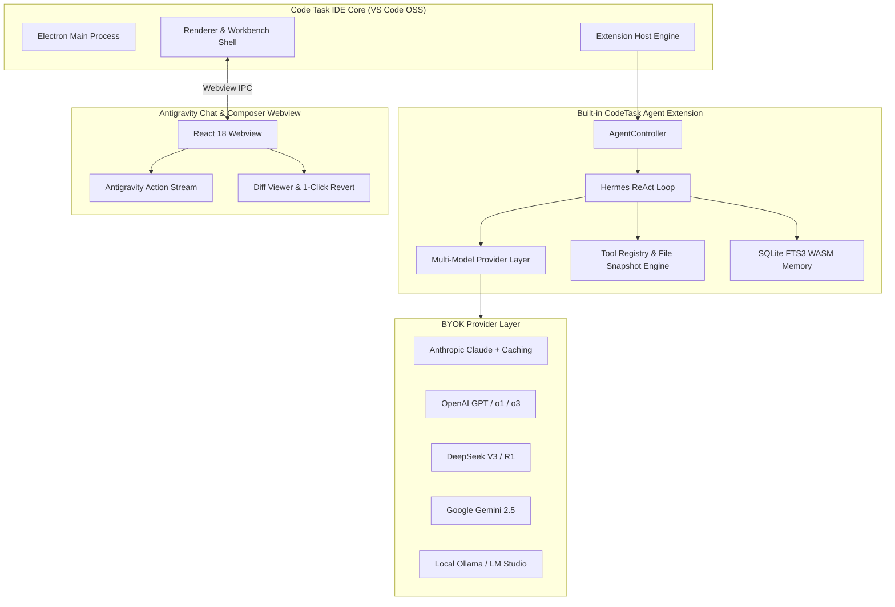

# 🖥️ Code Task IDE — The AI-Native Open Source IDE

<div align="center">

[](https://opensource.org/licenses/MIT)
[](#-100-free--open-source-byok)
[](https://github.com/microsoft/vscode)
[](https://agentskills.io)
[](#-privacy--zero-telemetry)
[](https://open-vsx.org/)

**The 100% Free & Open Source, AI-Native Desktop IDE with Zero Lock-In & BYOK.**  
*Built on clean VS Code / VSCodium Core • Built-in CodeTask AI Agent • Antigravity-Style Action Stream • 1-Click Revert • Zero Telemetry.*

[Key Features](#-key-features) • [Why Code Task IDE?](#-why-code-task-ide) • [Quick Start](#-quick-start--development) • [Building Releases](#-building-release-binaries) • [Architecture](#-architecture) • [BYOK Setup](#-configuration-byok-setup) • [License](#-license)

</div>

---

## 🌟 Why Code Task IDE?

Proprietary AI editors (such as Cursor, Windsurf, or GitHub Copilot) force developers into closed ecosystems, expensive monthly subscriptions ($20–$200/mo), hidden token markups, and proprietary backend proxies that route your private source code through third-party servers.

**Code Task IDE** gives you complete freedom and ownership:

| Feature | Code Task IDE | Cursor / Windsurf | GitHub Copilot |
|---|---|---|---|
| **Price** | **100% Free & Open Source (MIT)** | $20 – $200 / month | $10 – $19 / month |
| **Model Choice** | **Any Model (BYOK + Local Ollama)** | Locked / Cloud Proxy | Locked to OpenAI / Anthropic |
| **Source Code Privacy** | **Direct to Provider (No Proxy)** | Proxied via company servers | Proxied via Microsoft / OpenAI |
| **Offline / Air-Gapped** | **Yes (Ollama, LM Studio, vLLM)** | No | No |
| **Telemetry & Tracking** | **Zero Telemetry (100% Clean)** | Proprietary Tracking | Microsoft Telemetry |
| **Extension Marketplace** | **Open VSX + Manual VSIX** | Proprietary / Open VSX | VS Code Marketplace |
| **Version Revert & Safety** | **1-Click Snapshot Revert** | Manual Undo | Manual Undo |
| **Agent Standard** | **Hermes + DeepSeek Harness** | Proprietary Agent | Blackbox Agent |

---

## ✨ Key Features

### 🤖 1. Native Built-in Autonomous Agent
Code Task IDE ships with the **CodeTask AI Engine** pre-embedded into the desktop core:
- **Plan Mode (`🛡️ Plan`)**: Safe exploration and architecture design. Generates `implementation_plan.md` without modifying any workspace code.
- **Build Mode (`⚡ Build`)**: Autonomous software engineering with test execution, file editing, diagnostic verification, and self-healing loops.

### 🎨 2. Antigravity-Style Action Stream & Quick File Opener
- **Minimalist Action Display**: Real-time visual feedback for every agent operation:
  - `Edited ⚛️ AppLayout.tsx +25 -3 ›`
  - `Created 📄 ChatBot.tsx +140 ›`
  - `Ran 💻 npm run test ›`
- **Instant File Open**: Click directly on any file badge in the chat history to immediately open and focus that file in the editor.
- **Side-by-Side Diff & 1-Click Revert**: Inspect exact changes with native side-by-side diffs and roll back any file to its pre-edit state with a single click.

### 🔑 3. Universal BYOK (Bring Your Own Key) Gateway
Connect directly to any LLM provider with encrypted local key storage:
- **Anthropic Claude**: `claude-3-7-sonnet`, `claude-3-5-sonnet` (with native **Prompt Caching** header support, saving up to 90% cost).
- **OpenAI**: `gpt-4o`, `gpt-4o-mini`, `o1`, `o3-mini`, plus OpenAI Responses API.
- **DeepSeek**: `deepseek-chat` (V3), `deepseek-reasoner` (R1) with native reasoning stream and thought capture.
- **Google Gemini**: `gemini-2.5-flash`, `gemini-2.5-pro`, `gemini-2.0-flash`.
- **Local & Offline**: **Ollama**, **LM Studio**, **vLLM**, or any OpenAI-compatible localhost server.
- **OpenRouter**: Access hundreds of open-source models with unified billing.

### 🛡️ 4. Zero Telemetry & Total Privacy
- **Stripped Telemetry**: All Microsoft endpoints, telemetry pipes, and crash reporting trackers have been completely purged from `product.json` and `argv.json`.
- **Local-First Storage**: Session conversations, embeddings, and SQLite FTS3 memories reside strictly inside your local workspace (`.code-task-agent/`).

### 📦 5. Open VSX Ecosystem & Custom Skills
- **Open VSX Gallery**: Install extensions freely from the global [Open VSX Registry](https://open-vsx.org).
- **Built-in Coding SOPs**: Pre-packaged with standard hygiene skills ([AgentSkills.io](https://agentskills.io)):
  - `code-editing-hygiene`: Format preservation, zero lazy placeholders.
  - `systematic-debugging`: 4-step scientific hypothesis & root-cause verification.
  - `test-and-verify`: Auto-detects test frameworks (`npm test`, `pytest`, `cargo test`) and mandates green builds.
  - `smart-refactor`: API contract preservation and regression tests.
- **Model Context Protocol (MCP)**: Native `@modelcontextprotocol/sdk` client for `.mcp.json` tool expansion.

---

## 🚀 Quick Start & Development

### Prerequisites
- **Node.js**: `v20.x` or `v22.x` (LTS)
- **Yarn**: `npm install -g yarn`
- **Python**: `3.10+` (for native node modules compilation)
- **Windows**: Visual Studio C++ Build Tools (`Desktop development with C++`)

### 1. Clone & One-Click Setup
```powershell
# Clone the repository
git clone https://github.com/code-task-agent/CodeTask.git
cd CodeTask/CodeTask-IDE

# Run automated setup (injects CodeTask engine & Open VSX configuration)
node scripts/setup.mjs
```

### 2. Launch in Development Mode
To start Code Task IDE locally with hot-reloading and instant debugger:
```powershell
npm run dev
```

---

## 📦 Building Release Binaries

To compile and package a standalone desktop distribution for Windows:

```powershell
npm run build:win
```

The resulting standalone executable package will be created at:
```
CodeTask-IDE/VSCode-win32-x64/Code Task.exe
```

---

## 🏛️ Architecture



---

## 📂 Directory Layout

```
CodeTask-IDE/
├── config/
│   ├── product.json      # Branding, Open VSX marketplace, zero-telemetry config
│   └── argv.json         # Crash reporter disabled by default
├── scripts/
│   ├── setup.mjs         # Embeds CodeTask Agent & applies branding to engine
│   ├── dev.ps1           # Launches IDE in local dev mode
│   ├── build.mjs         # Build orchestration script
│   ├── build-win.ps1     # Complete packaging pipeline for Windows (.exe)
│   └── clean.mjs         # Workspace and build cache cleaner
├── vscode-src/           # Clean VS Code OSS upstream source tree
│   └── extensions/
│       └── code-task-agent/  # Embedded native agent extension
├── package.json
└── README.md
```

---

## ⚙️ Configuration (BYOK Setup)

1. Launch **Code Task IDE**.
2. Click the **Code Task AI** icon on the Activity Bar.
3. Open **⚙️ Settings** $\rightarrow$ **Add Provider Profile**.
4. Configure your preferred endpoint:
   - **Anthropic Claude**: `https://api.anthropic.com/v1` (`claude-3-7-sonnet` / `claude-3-5-sonnet`)
   - **DeepSeek**: `https://api.deepseek.com/v1` (`deepseek-chat` / `deepseek-reasoner`)
   - **OpenAI**: `https://api.openai.com/v1` (`gpt-4o` / `o3-mini`)
   - **Google Gemini**: `https://generativelanguage.googleapis.com/v1beta/openai/` (`gemini-2.5-flash`)
   - **Ollama (Local Offline)**: `http://localhost:11434/v1` (`qwen2.5-coder:32b` / `deepseek-r1:14b`)
5. Enter your API key. Keys are secured locally via the OS Keychain / VS Code SecretStorage.

---

## 🛡️ License

Code Task IDE is licensed under the **[MIT License](LICENSE)**.  
VS Code OSS source code is licensed under the Microsoft MIT License.
