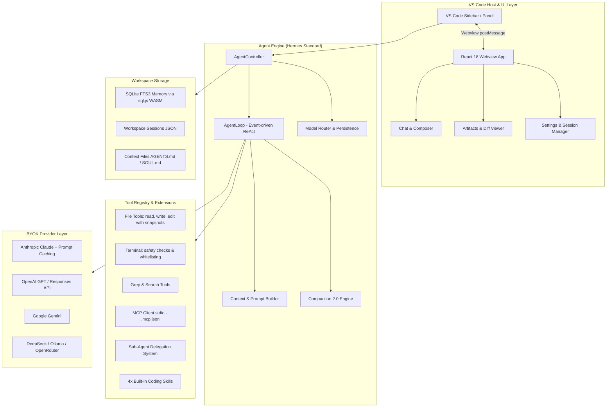

# ⚡ Code Task Agent for VS Code

<div align="center">

[](https://opensource.org/licenses/MIT)
[](#-100-free--open-source-byok)
[](https://agentskills.io)
[](https://www.typescriptlang.org/)
[](https://code.visualstudio.com/)
[](https://vitest.dev/)

**The autonomous, transparent, and hackable AI coding agent inside Visual Studio Code.**  
*BYOK (Bring Your Own Key) • Claude-Style Prompt Caching • Built-in Coding Skills • Instant Revert • MCP Client • Zero Lock-in.*

[Key Features](#-key-features) • [Quick Start](#-quick-start) • [Built-in Skills](#-built-in-coding-skills) • [Context & Memory](#-memory--context-architecture) • [Architecture](#-system-architecture) • [Contributing](#-development--contributing)

</div>

---

## 🌟 Why Code Task Agent?

Most AI coding assistants lock you into proprietary subscriptions, obscure their prompts, or leak your code through third-party proxies.

**Code Task Agent** gives you full control:
- **100% Open Source & Free Forever**: No hidden limits, paywalls, or premium tiers.
- **Direct BYOK Connection**: Talk directly to OpenAI, Anthropic Claude, Google Gemini, DeepSeek, OpenRouter, or **run 100% offline & private with Ollama / LM Studio**.
- **Observable & Reversible**: Inspect every file diff side-by-side, inspect every tool call in real time, and **revert any change with a single click**.
- **State-of-the-Art Agent Loop**: Built upon the **Hermes Agent Standard** and **OpenCode Harness Architecture** with automated compaction, prompt caching, and subagent delegation.

---

## ✨ Key Features

### 🔑 1. Universal BYOK Provider Layer
Connect to any model or provider with native streaming and tool calling:
- **Anthropic Claude**: `claude-3-7-sonnet`, `claude-3-5-sonnet`, `claude-3-5-haiku` (with native **Prompt Caching** header support).
- **OpenAI**: `gpt-4o`, `gpt-4o-mini`, `o1`, `o3-mini`, plus OpenAI Responses API.
- **Google Gemini**: `gemini-2.5-flash`, `gemini-2.5-pro`, `gemini-2.0-flash`.
- **DeepSeek**: `deepseek-chat` (V3), `deepseek-reasoner` (R1).
- **Local & Self-Hosted**: **Ollama**, **LM Studio**, **vLLM**, or any custom OpenAI-compatible endpoint.
- **OpenRouter**: Access hundreds of open-source and proprietary models seamlessly.

### ⚡ 2. Auto Model Persistence & Task Routing
- **Smart Model Persistence**: When you select a model, Code Task Agent remembers your selection across sessions, workspaces, and VS Code reloads.
- **`⚡ Auto` Routing**: Automatically selects the most suitable model profile for complex architectural planning vs fast editing.

### 🛡️ 3. Plan Mode vs ⚡ Build Mode
- **Plan Mode (`🛡️ Plan`)**: Safe, read-only exploration (`read_file`, `list_dir`, `grep_search`). The agent constructs structured `implementation_plan.md` artifacts without modifying workspace code.
- **Build Mode (`⚡ Build`)**: Full execution loop with file modifications (`edit_file`, `write_file`), terminal commands (`run_terminal_command`), and automated verification.

### 📝 4. Side-by-Side Diff & ⏪ One-Click Version Revert
- **Pre-Execution Snapshot Engine**: Before every file modification, Code Task Agent records the exact original file content.
- **Interactive Diff Viewer**: Click **`Diff`** on any tool card in the chat to open VS Code's native side-by-side diff comparing *Original ↔ Proposed*.
- **Instant Revert**: Click **`Revert`** to immediately roll back any modified file to its exact pre-edit version (or delete newly created files).

### 🧠 5. Claude-Style Prompt Caching & Compaction 2.0
- **Ephemeral Prompt Caching**: System prompts and tool definitions are tagged with cache breakpoints for Anthropic API, reducing token latency and costs by up to 90%.
- **Structured Working State Snapshot**: When conversation history grows large, Compaction 2.0 creates a structured state snapshot (modified files, inspected files, executed terminal commands, key discoveries) while strictly preserving tool-call/result pairs.

### 📦 6. Built-in Coding Skills (Zero-Setup SOPs)
Packed with 4 built-in standard operating procedures adhering to the [AgentSkills.io](https://agentskills.io) standard:
1. **`code-editing-hygiene`**: Enforces reading before writing, atomic targeted edits, zero lazy placeholders (`// ... rest of code`), and format preservation.
2. **`systematic-debugging`**: 4-step scientific protocol: Traceback analysis $\rightarrow$ Hypothesis $\rightarrow$ Root cause fix $\rightarrow$ Regression verification.
3. **`test-and-verify`**: Auto-detects test frameworks (`npm test`, `pytest`, `cargo check`, `go test`) and mandates green builds.
4. **`smart-refactor`**: Baseline test verification, public API contract preservation, and incremental safe changes.

### 🔌 7. Model Context Protocol (MCP) Client
Native `@modelcontextprotocol/sdk` stdio client. Drop a `.mcp.json` into your workspace root to immediately extend the agent with custom database connectors, external tools, and browser automation.

### 💾 8. Workspace-Scoped SQLite Memory & Sessions
- **Isolated Per Workspace**: Session history and memory are scoped to each workspace folder (`.code-task-agent/`).
- **SQLite FTS3 Full-Text Search**: Fast, embedded semantic recall powered by `sql.js` (WASM) — no native binary rebuilds required.
- **JIT Memory Injection**: Dynamically retrieves relevant context and project facts into the agent's working memory.

### 🤖 9. Sub-Agent Delegation & Multimodal Vision
- **Concurrent Sub-Agents**: Spawn background worker agents (`researcher`, `coder`, `tester`) to tackle multi-threaded research without context clutter.
- **Multimodal Vision**: Attach screenshots and UI mockups directly into chat. Automatically adapts payload for vision vs text-only models.

---

## 🚀 Quick Start

### Installation

1. **Clone & Install Dependencies**:
   ```bash
   git clone https://github.com/code-task-agent/code-task-agent.git
   cd code-task-agent
   npm install
   ```

2. **Build the Extension**:
   ```bash
   npm run build
   ```

3. **Launch in VS Code**:
   - Open the directory in VS Code: `code .`
   - Press **`F5`** (or Run $\rightarrow$ Start Debugging) to launch the **Extension Development Host**.
   - Click the **Code Task Agent** icon in the Activity Bar.

### Packaging Offline VSIX

To build a standalone `.vsix` installer for VS Code or Cursor:
```bash
npm run package
```
Install the generated `.vsix` via **Extensions $\rightarrow$ ... $\rightarrow$ Install from VSIX...**

---

## ⚙️ Configuration (BYOK Setup)

1. Open the Code Task Agent sidebar.
2. Click **⚙️ Settings** (or run `Ctrl+Shift+P` $\rightarrow$ `Code Task Agent: Setup Provider & API Key`).
3. Click **＋ Add Provider Profile**:
   - **OpenAI**: Base URL `https://api.openai.com/v1`, Model `gpt-4o`
   - **Anthropic**: Base URL `https://api.anthropic.com/v1`, Model `claude-3-5-sonnet-20241022`
   - **Gemini**: Base URL `https://generativelanguage.googleapis.com/v1beta/openai/`, Model `gemini-2.5-flash`
   - **DeepSeek**: Base URL `https://api.deepseek.com/v1`, Model `deepseek-chat`
   - **Ollama (Local)**: Base URL `http://localhost:11434/v1`, Model `qwen2.5-coder:32b`
4. Enter your API Key. All keys are encrypted locally inside VS Code's secure `SecretStorage`.

---

## 📁 Memory & Context Architecture

Code Task Agent automatically reads context files in your repository to align with your project's unique conventions:

| File | Purpose | Scope |
|---|---|---|
| `AGENTS.md` | Project architecture, coding conventions, build/test commands | Repository / Global |
| `SOUL.md` | Agent persona, communication style, tone, domain guidelines | Project / User |
| `CONTEXT.md` | Current session objectives, active feature sprint notes | Session |
| `MEMORY.md` | Persistent long-term facts, architectural decisions, and learnings | Workspace |
| `skills/<name>/SKILL.md` | Custom project SOPs with YAML frontmatter | Workspace |

---

## 🏗️ System Architecture



---

## ⌨️ Commands & Shortcuts

| Command | Action |
|---|---|
| `Code Task Agent: Open Chat` | Open the agent sidebar view |
| `Code Task Agent: Open Panel` | Open agent in the secondary editor panel |
| `Code Task Agent: Setup Provider & API Key` | Open settings manager |
| `Code Task Agent: Add Current File to Agent Context` | Mention active file into composer |
| `Escape` / `Stop` button | Cancel running agent execution or tool call |
| `@filename` / `@symbol` | Context mention auto-completion |

---

## 🧪 Development & Contributing

```bash
# Typecheck TypeScript (extension + webview)
npm run typecheck

# Run linter
npm run lint

# Run Vitest test suite (75 tests)
npm test

# Build extension bundle
npm run build

# Watch mode for rapid development
npm run watch
```

---

## 📄 License

Distributed under the **MIT License**. Free for personal and commercial use.
